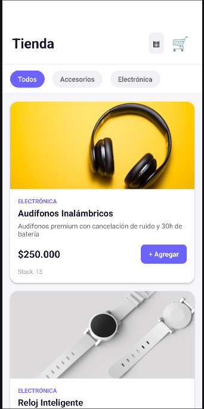
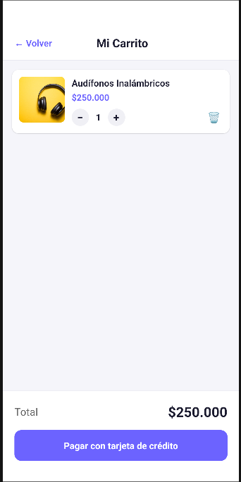
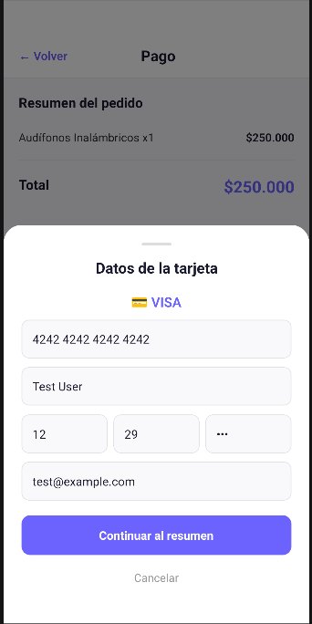
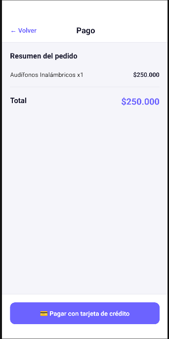
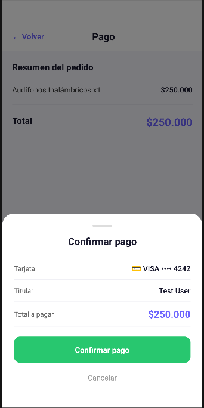
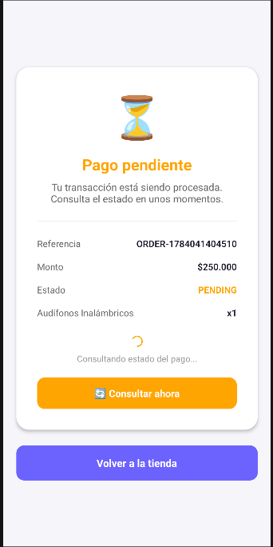
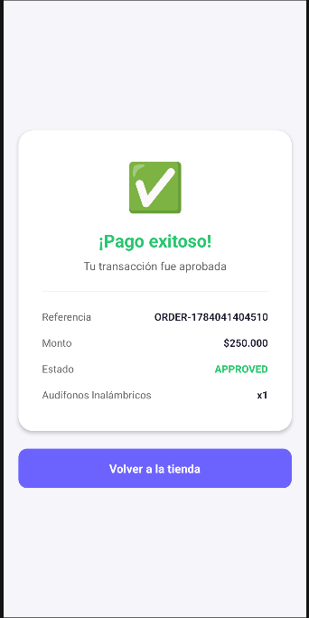

# 💳 Payment Checkout App

Aplicación de checkout de pago con tarjeta de crédito. Incluye una app móvil (React Native) y una API backend (NestJS) integrada con pasarela de pagos en entorno Sandbox.

---

## 📸 Screenshots — Flujo de la App

### 1. Home de Productos
Catálogo de productos con filtros por categoría y opción de vista lista/grilla. El usuario puede agregar 1 o N productos al carrito.



### 2. Carrito de Compras
Muestra los productos seleccionados con controles de cantidad (+/-), opción de eliminar y el total a pagar. Incluye el botón para proceder al pago con tarjeta de crédito.



### 3. Datos de Tarjeta (Backdrop)
Formulario en componente backdrop para ingresar los datos de la tarjeta. Incluye validación en tiempo real (algoritmo de Luhn), detección automática de marca (Visa/Mastercard) y validación de fecha de expiración y CVC.



### 4. Resumen del Pago (Backdrop)
Muestra el resumen con los datos de la tarjeta enmascarada, titular y monto total antes de confirmar.



### 5. Confirmando Pago
Se procesa la transacción contra la pasarela de pagos. El spinner se mantiene visible durante toda la operación.



### 6. Pago Pendiente
Si la pasarela responde PENDING, la app consulta automáticamente el estado cada 2.5 segundos hasta obtener el resultado final. También incluye un botón manual para consultar.



### 7. Pago Exitoso
Resultado final mostrando la transacción aprobada con referencia, monto y detalle de productos. El botón "Volver a la tienda" reinicia el flujo.



---

## 📱 Estructura del Proyecto

```
payment-checkout/
├── mobile/              # App React Native (Android/iOS)
│   ├── src/
│   │   ├── screens/     # 5 pantallas (7 pasos del flujo)
│   │   ├── store/       # Redux Toolkit (3 slices)
│   │   ├── services/    # API client (axios)
│   │   ├── utils/       # Validación tarjeta, encrypted storage
│   │   ├── navigation/  # Stack Navigator
│   │   └── types/       # TypeScript types
│   ├── __tests__/       # 92 unit tests (86% cobertura)
│   └── app-release.apk  # APK listo para instalar
│
├── backend/             # API NestJS + TypeScript
│   ├── src/
│   │   ├── products/    # Catálogo de productos
│   │   ├── transactions/# Gestión de transacciones
│   │   └── payment/     # Integración pasarela de pagos
│   ├── Dockerfile       # Docker ready
│   └── test/            # 68 unit tests (94% cobertura)
│
└── README.md
```

---

## 🚀 Inicio Rápido

### Requisitos
- Node.js 22+
- npm 10+
- Android Studio (con emulador arm64-v8a API 34)
- Java 17

### Backend

```bash
cd backend
npm install
cp .env.template .env
# Editar .env con las API Keys de Sandbox
npm run start:dev
```

El servidor inicia en `http://localhost:3000`

### Mobile

```bash
cd mobile
npm install

# Iniciar Metro
npx react-native start

# En otra terminal, con emulador corriendo:
npx react-native run-android
```

### Docker (Backend)

```bash
cd backend
docker build -t payment-api .
docker run -p 3000:3000 --env-file .env payment-api
```

---

## 📱 Flujo de la App (7 pasos)

| # | Pantalla | Descripción |
|---|----------|-------------|
| 1 | Splash Screen | Pantalla de carga con branding "PayFlow" |
| 2 | Home de Productos | Catálogo con filtros por categoría y vista lista/grilla |
| 3 | Selección de Producto | Agregar 1 o N items al carrito |
| 4 | Checkout | Resumen del pedido + botón "Pagar con tarjeta de crédito" |
| 5 | Info Tarjeta (Backdrop) | Formulario con validación Luhn y detección Visa/MC |
| 6 | Resumen Pago (Backdrop) | Confirmación del pago con datos de tarjeta |
| 7 | Resultado | Estado de la transacción (aprobada/rechazada/pendiente) |

---

## 🔧 API Endpoints

### Productos
| Método | Endpoint | Descripción |
|--------|----------|-------------|
| GET | /products | Listar todos los productos |
| GET | /products/:id | Obtener producto por ID |

### Transacciones
| Método | Endpoint | Descripción |
|--------|----------|-------------|
| POST | /transactions | Crear transacción (tokeniza + procesa pago) |
| GET | /transactions | Listar transacciones |
| GET | /transactions/:id | Obtener transacción por ID |
| PATCH | /transactions/:id/refresh | Consultar estado actualizado |

### Body para crear transacción
```json
{
  "customerEmail": "cliente@email.com",
  "items": [{ "productId": "1", "quantity": 1 }],
  "cardData": {
    "number": "4242424242424242",
    "cvc": "123",
    "exp_month": "12",
    "exp_year": "29",
    "card_holder": "Test User"
  },
  "installments": 1
}
```

---

## 🧪 Tests

### Backend
```bash
cd backend
npm test              # Ejecutar tests
npm test -- --coverage  # Con cobertura
```
**Resultado**: 68 tests | 94% cobertura

### Mobile
```bash
cd mobile
npx jest              # Ejecutar tests
npx jest --coverage   # Con cobertura
```
**Resultado**: 92 tests | 86% cobertura

---

## 📦 APK

El archivo `mobile/app-release.apk` está listo para instalar en cualquier dispositivo Android.

Para generar un nuevo APK:
```bash
cd mobile/android
./gradlew assembleRelease
# Output: android/app/build/outputs/apk/release/app-release.apk
```

---

## 🏗️ Tecnologías

### Mobile
- React Native 0.86
- Redux Toolkit 2.12
- React Navigation 7
- TypeScript
- Axios
- React Native Encrypted Storage
- Jest

### Backend
- NestJS 11
- TypeScript
- class-validator / class-transformer
- Axios (HttpModule)
- Docker
- Jest

---

## 🔐 Seguridad

- Datos de transacción almacenados con `react-native-encrypted-storage`
- Validación de inputs (class-validator en backend, Luhn en mobile)
- Variables de entorno para API keys (nunca hardcodeadas en producción)
- CORS configurado
- Firma de integridad SHA256 en cada transacción

---

## 🃏 Tarjetas de Prueba (Sandbox)

| Número | Marca | Resultado |
|--------|-------|-----------|
| 4242 4242 4242 4242 | Visa | APROBADA |
| 4111 1111 1111 1111 | Visa | RECHAZADA |

**Datos de prueba**: MM=12, YY=29, CVC=123, Titular=Test User

---

## 📋 Variables de Entorno (Backend)

```env
PORT=3000
PAYMENT_API_URL=https://api-sandbox.co.uat.wompi.dev/v1
PAYMENT_PUBLIC_KEY=pub_stagtest_...
PAYMENT_PRIVATE_KEY=prv_stagtest_...
PAYMENT_INTEGRITY_KEY=stagtest_integrity_...
```
